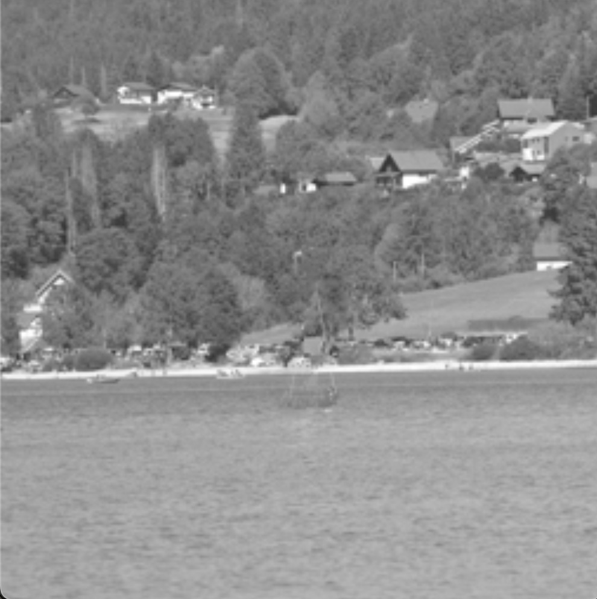

# Object Removal by Exemplar-Based Inpainting

This repository contains an implementation of the algorithm presented in **"Object Removal by Exemplar-Based Inpainting"** by Criminisi, Pérez, and Toyama. This exemplar-based inpainting algorithm is designed to remove large objects from grayscale images and fill in the resulting hole in a visually plausible way. By combining techniques from **texture synthesis** and **structure propagation**, this method can seamlessly blend surrounding textures and structures into the target region without introducing blur or artifacts. The algorithm achieves this by prioritizing patches along the fill front, allowing for accurate replication of both textures and linear structures, even in large missing regions.

## Example

  
  
  

  <em>Original Image</em> &emsp; &emsp; &emsp; &emsp; &emsp; <em>Image with Target Region</em>  &emsp; &emsp; &emsp; &emsp; &emsp; <em>Inpainted Image</em>

## References
* **A. Criminisi, P. Pérez, and K. Toyama.** Object Removal by Exemplar-Based Inpainting. IEEE Transactions on Image Processing, 2003.
